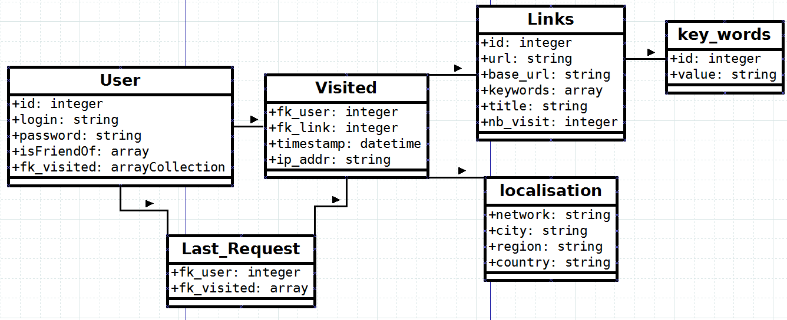

SmartBrowserMotionner
=============

### Description ###
Projet en classe dont le but était de développer un gestionnaire de marque-pages communautaire.
Composé d'une extension firefox côté client et d'un serveur Symfony2 en backend, utilisant une BDD MySql à l'aide de l'ORM Doctrine (développé sur serveur local Wamp).
L'application traite les pages web visitées par l'utilisateur en extrayant tout d'abord le corps de la page (un article par exemple) puis à partir de ce corpus les mots-clés en sont
extraits.

### User story ###
- A chaque page visitée, l'url de la page est envoyée au serveur afin de la traiter.
- L'utilisateur peut passer en mode confidentiel afin de suspendre le comportement précedemment cité.
- A tout moment, lorsqu'il clique sur un bouton, il reçoit une liste de pages webs à partir du matching des mots-clés de la page courante et des autres pages visitées par
les autres utilisateurs de l'application.
- Il peut trier/restreindre les résultats selon leur date, leur nombre de vues, leur géolocalisation, ses relations d'amitiés etc...

### Modèle conceptuel de données ###

Développé dans le cadre de l'UV [MGL825](http://www.etudier.uqam.ca/cours?sigle=MGL825) (Télématique et réseaux) à l'ETS Montréal.